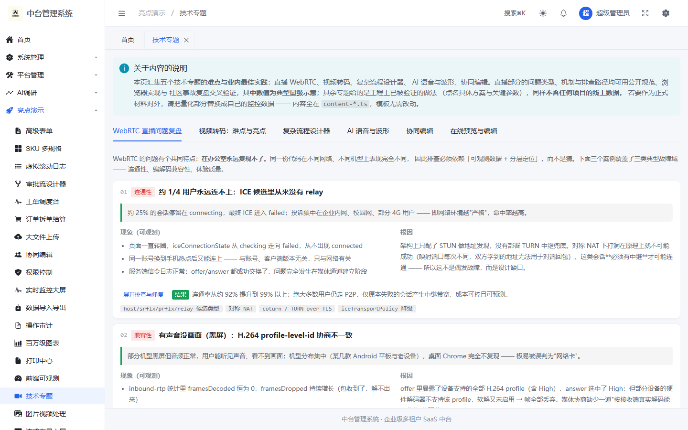
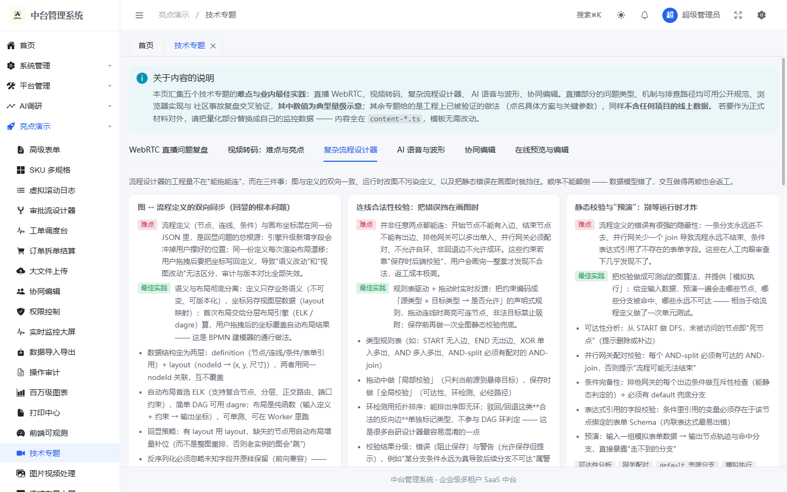
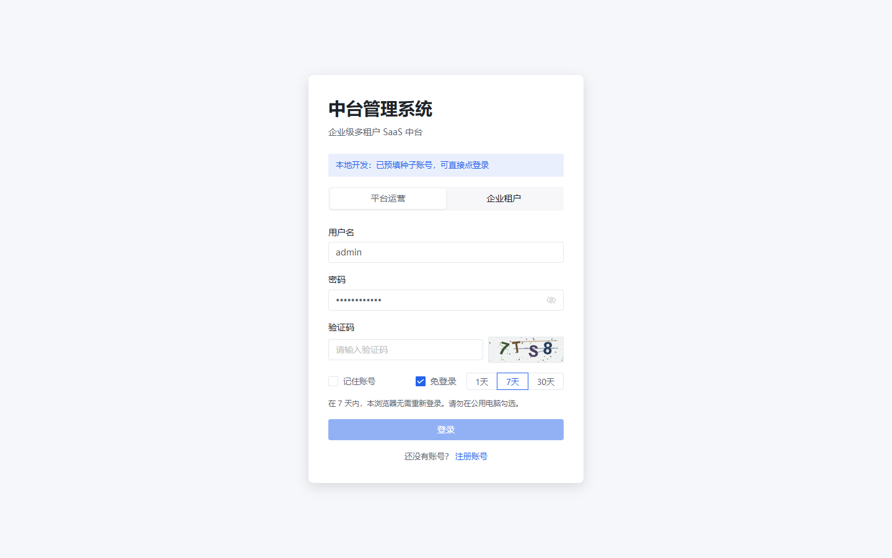

# web-all

企业级多租户 SaaS 中台基座（Java 25 + Spring Boot 4 后端，Vue 3.5 + Vite 8 前端）。

**在线预览**：<https://webadmin-demo.onrender.com/dashboard>（免费托管，登录页已预填演示账号，15 分钟无访问会休眠、首次打开需等约 1 分钟唤醒）

DDD 分层内核、契约优先的前后端协作、可执行的质量门禁。除骨架之外已落地一整套可用的业务能力：认证与 RBAC、动态菜单、多租户隔离、AI 对话与调研、工单调度、审计日志、消息中心、大文件上传、Excel 导入导出任务，以及一批技术演示页（协同编辑、审批流设计器、监控大屏等）。

## 功能总览

| 领域 | 能力 |
|---|---|
| 认证与会话 | 图片验证码登录、JWT 双令牌、免登录时长选择、令牌版本号强制下线、账号锁定/停用 |
| 权限 | RBAC（角色-菜单-权限点四处同步）、按钮级权限指令、数据权限拦截器挂载位、动态菜单与前端路由装配 |
| 多租户 | 租户 Provisioning、配额、`TenantContext` + MyBatis 租户拦截器自动隔离、异步/虚拟线程上下文传递 |
| AI | OpenAI 兼容网关接入的流式对话（SSE）、AI 调研（问卷/报告/采集）、命令面板 |
| 工单调度 | 工单全生命周期、WebSocket 实时面板、握手票据认证 |
| 数据传输 | Excel 导入（两阶段：校验→确认，错误精确到行列）、导出、任务档案表（重启后可查）、失败行重试 |
| 协作 | 站内消息中心（SSE 实时推送）、公告、WebSocket 监控面板 |
| 可观测 | 前端错误上报、接口耗时采集、后端审计日志（落库+查询） |
| 工程演示页 | 大文件上传（分片+断点+Worker 哈希）、协同编辑（OT）、审批流设计器（Vue Flow）、监控大屏（ECharts）、实时日志 |

「亮点演示 → 技术专题」把直播、转码、流程设计器等领域的线上问题复盘与设计决策固化成团队可复用的文档页：





## 技术栈与选型理由

### 后端

| 选型 | 为什么是它 | 代价与边界 |
|---|---|---|
| **Java 25（LTS）+ 虚拟线程** | 虚拟线程把"每个请求一个平台线程"的并发模型换成低成本的挂起，IO 密集的中台场景直接受益；Excel 导入导出的工作线程也跑在虚拟线程上 | 必须显式限制 HikariCP 连接池大小，否则虚拟线程会把连接池打爆（`application.yml` 有注释） |
| **Spring Boot 4.0** | 沿用 Spring 生态的成熟度；Boot 4 的模块化（`spring-boot-data-redis` 等独立 starter）让依赖更收敛 | 版本较新，部分第三方 starter 需要 boot4 适配版（MyBatis-Plus 用的是 `mybatis-plus-spring-boot4-starter`） |
| **MyBatis-Plus** | 中台的大量列表/条件查询写 SQL 模板收益低；MP 的条件构造器 + 租户/数据权限拦截器是现成的挂钩位 | 复杂查询仍走 XML；关联表无单列主键时不用 `xxById` 方法（启动日志有例行提示） |
| **Flyway** | 29 个迁移脚本按版本号线性演进，`V1.1.x` 命名即变更史；CI 有 `flyway validate` | 迁移一旦合入不可修改，只能追加 |
| **Spring Modulith（事务性 Outbox）** | 领域事件先落 `event_publication` 再异步派发，保证"状态变更"与"事件发布"的原子性 | 监听器在独立线程执行，消费方要自己处理幂等 |
| **Spring Security + JWT（双令牌）** | 无状态横向扩展；令牌里带**版本号**，改密码/强制下线只需 bump 版本号让旧令牌当场失效，不必等过期 | 令牌签发与校验密钥管理需要运维配合（见核心配置） |
| **ArchUnit** | 把"领域层零框架依赖、依赖方向不可逆"写成单元测试——违规不是被 review 拦下，而是被 CI 拦下 | 每新增一条架构红线要同步补测试 |

### 前端

| 选型 | 为什么是它 | 代价与边界 |
|---|---|---|
| **Vue 3.5 + Vite 8（Rolldown）+ TypeScript** | 组合式 API 的逻辑复用（composables）与中台的表单/列表密集场景契合；Vite 8 统一了 dev/build 引擎 | Vite 8 较新，插件生态偶有版本敏感（`@vitejs/plugin-vue` 用 v6） |
| **pnpm workspace + Turborepo** | 前端拆成 4 个包（见骨架树），包间依赖用 `workspace:*`；构建编排交给 turbo | 装依赖必须用 pnpm（lockfile 是 pnpm 格式） |
| **Naive UI + 精确注册** | 全量引入会把首屏推到 890KB gzip；改为**按模板扫描登记**（`check:naive` 门禁保证"用到的必已注册"），降到 324KB | 新用组件必须先登记——门禁会拦，不是靠自觉 |
| **自研布局引擎（ProLayout/ProMenu/ProTable）** | 布局壳需要与菜单 DOM/类名强配合（收缩宽度、缩进节奏、激活条、页签五种风格），穿透第三方组件的内部类名不可靠；自研结构直接消费后端菜单树 | 维护成本自担；组件必须附 Histoire story（ui-component-policy） |
| **契约优先（OpenAPI → orval 生成）** | 前端不手写请求类型；CI 重新生成并与提交产物比对，**契约漂移会在 CI 变红**，而不是在联调时吵架 | 生成产物入库（体积换取确定性） |
| **Oxlint** | 单文件毫秒级 lint，把"架构红线"（禁止业务代码 import naive-ui 等）做成 lint 规则 | 规则覆盖面比 ESLint 窄，作为第一道快门禁 |
| **Design Token 单一来源（@admin/theme）** | 主题切换、暗色模式、灰度/弱化模式全部收敛到 token 层，组件内不出现魔法色值 | 新增视觉能力先加 token 再消费 |

## 架构

```
                      ┌────────────────────────────────────────────┐
   浏览器              │                Spring Boot 4               │
┌──────────┐  HTTP    │  ┌──────────────────────────────────────┐  │
│ Vue 3 SPA │────────▶│  │ Filters: TenantContext → JWT 认证     │  │
│ (动态路由  │          │  │          → 限流 → 幂等                │  │
│  菜单驱动) │◀──SSE/WS─│  ├──────────────────────────────────────┤  │
└──────────┘          │  │ admin-interfaces   Controller / R<T>  │  │
                      │  ├──────────────────────────────────────┤  │
   Render/TiDB/Upstash│  │ admin-application  AppService(事务边界)│  │
┌──────────┐          │  │        │            │ 领域事件 → Outbox │  │
│  MySQL    │◀─────────│  │        ▼            ▼                  │  │
│ (Flyway   │          │  │ admin-domain      application          │  │
│  29 迁移) │          │  │ (零框架)          │ Port 接口           │  │
└──────────┘          │  │ admin-infrastructure ◀── Port 实现     │  │
┌──────────┐          │  │ (MyBatis / 安全 / 存储 / 档案)          │  │
│  Redis    │◀─────────│  └──────────────────────────────────────┘  │
│ (会话/失效│          └────────────────────────────────────────────┘
│  /限流)   │
└──────────┘
```

分层规则（由 ArchUnit 强制）：`interfaces → application → domain`，`infrastructure` 实现 `application` 声明的 Port 并反向注入；`domain` 不 import 任何 Spring/MyBatis 类。

## 项目骨架

```
web-all/
├─ apps/
│  └─ admin/                        # 前端主应用（登录/业务页/showcase）
│     ├─ src/layouts/               #   BasicLayout + SettingDrawer（全局配置）
│     ├─ src/stores/                #   pinia：app(偏好)/auth/tabs(页签)/permission(菜单权限)
│     ├─ src/views/                 #   业务页面（iam/org/platform/tenant/survey/showcase…）
│     ├─ src/api/                   #   按域组织的请求封装（基于 @admin/api 生成层）
│     └─ e2e/                       #   Playwright E2E（页签持久化/固定头部）
├─ packages/
│  ├─ ui/                           # ★ 唯一允许 import naive-ui/vxe/form-create 的包
│  │  └─ src/components/pro/        #   ProLayout / ProMenu / ProTable / ProForm 布局引擎
│  ├─ api/                          # ★ OpenAPI 生成产物 + 客户端（契约优先）
│  ├─ theme/                        # Design Token 唯一来源
│  └─ config/                       # 共享 tsconfig
├─ server/                          # 后端 Maven 多模块（8 个，含 test-support）
│  ├─ admin-common/                 #   零框架内核：错误码/R<T>/TenantContext/雪花ID
│  ├─ admin-domain/                 # ★ 领域层：聚合/值对象/领域事件（零框架依赖）
│  ├─ admin-application/            #   应用服务（事务边界）+ Port 接口
│  ├─ admin-infrastructure/         #   Port 实现：MyBatis PO/Mapper、安全、文件存储
│  ├─ admin-interfaces/             #   Controller、拦截器（限流/幂等/租户）、SPA 托管
│  ├─ admin-bootstrap/              #   启动模块 + db/migration（Flyway 29 个脚本）
│  └─ admin-test-support/           #   测试基建
├─ scripts/                         # 门禁脚本（naive 登记/体积棘轮/verify-all）+ 生成器
├─ Dockerfile / render.yaml         # 免费托管部署（见 docs/deploy-free.md）
└─ .github/workflows/ci.yml        # 三门禁 CI：后端 mvn verify / 前端门禁 / 契约一致性
```

## 核心配置

后端 `server/admin-bootstrap/src/main/resources/application.yml`，全部支持环境变量覆盖：

| 变量 | 默认 | 说明 |
|---|---|---|
| `DB_HOST/DB_PORT/DB_NAME` | `localhost/3306/webadmin` | MySQL 连接 |
| `DB_USERNAME/DB_PASSWORD` | `root/root` | 数据库凭据 |
| `DB_SSL_MODE` | `PREFERRED` | 托管库（TiDB 等）TLS 模式 |
| `REDIS_HOST/REDIS_PORT` | `localhost/6379` | Redis 连接 |
| `REDIS_PASSWORD` / `REDIS_SSL` | 空 / `false` | 托管 Redis（Upstash）需 `REDIS_SSL=true` |
| `REDIS_TIMEOUT` | `10s` | 连接与命令超时（免费托管冷启动别调小） |
| `INIT_ADMIN_PASSWORD` | `Admin@123456` | 管理员种子密码 |
| `AI_API_KEY/AI_BASE_URL/AI_MODEL` | DeepSeek 默认 | AI 网关 |
| `APP_WEB_STATIC_LOCATION` | `classpath:/static/` | 前端静态件目录（容器部署指向 `/app/static/`） |

本地个人配置走 `application-local.yml`（已 gitignore），从 `application-local.yml.example` 复制。

## 快速开始

依赖：JDK 25、Maven 3.9+、Node ≥ 22、pnpm 11（`packageManager` 字段固定）、MySQL 8、Redis 8。

```powershell
# 1. 起本地 Redis（docker compose 提供，独立端口/卷，避免与其他项目互相覆盖）
docker compose up -d redis

# 2. 建库（Flyway 启动时自动建表）
mysql -u root -p -e "CREATE DATABASE IF NOT EXISTS webadmin DEFAULT CHARACTER SET utf8mb4 COLLATE utf8mb4_general_ci;"

# 3. 后端（8080）
cd server
mvn clean install -DskipTests
mvn -pl admin-bootstrap spring-boot:run

# 4. 前端（5173）
pnpm install
pnpm dev
```

打开 <http://localhost:5173>，本地开发态登录页已预填种子账号 `admin / Admin@123456`（密码可用 `VITE_DEV_LOGIN_PASSWORD` 覆盖），输入验证码即可进入：



- 接口文档：<http://localhost:8080/swagger-ui.html>
- 健康检查：<http://localhost:8080/actuator/health>

> Redis 端口默认按本机 compose 的 6381（避开宿主机 6379 冲突），由 `application-local.yml` 控制；Docker 全栈方案见 `docker-compose.yml` 的 `fullstack` profile。

## 常用命令

```bash
pnpm dev               # 前端开发服务
pnpm verify            # 前端门禁全链：naive 登记 → lint → typecheck → build → 体积棘轮
pnpm verify:all        # 本地跑完整门禁（后端 + 前端 + 契约），与 CI 一致
pnpm gen:api           # OpenAPI → 前端类型与请求客户端
pnpm gen:check         # 校验生成产物与契约一致（CI 同款）
pnpm lint              # Oxlint（含架构红线）
pnpm story:dev         # Histoire 组件工作台
pnpm harness           # 启动 DeepSeek Harness（供 /ui/harness 页面 iframe 嵌入）

# 后端
mvn -pl admin-bootstrap test          # 单元测试 + ArchUnit 架构测试
mvn -pl admin-bootstrap spring-boot:run
```

## 质量门禁

CI（GitHub Actions）三个 job 与本地 `pnpm verify:all` 完全同构：

| Job | 内容 |
|---|---|
| 后端门禁 | `mvn verify`（单元测试 + ArchUnit + Flyway 校验） |
| 前端门禁 | `check:naive`（Naive 组件登记校验）→ `lint`（架构红线）→ `typecheck` → `build` → `check:size`（首屏 gzip 棘轮，当前 324KB，只降不升） |
| 契约门禁 | `gen:check`（重新生成客户端并与提交产物比对，漂移即失败） |

其中体积棘轮与 naive 精确注册是本项目特有的两道门禁：前者防止首屏体积回涨（历史 890KB → 324KB 的收敛记录在脚本注释里），后者保证"按需注册"的优化不被无意破坏。

## 免费托管部署

`Dockerfile` + `render.yaml` 已就绪：Render 免费层跑前后端同容器，TiDB Cloud Serverless 做 MySQL，Upstash 做 Redis，push 到 GitHub 即自动部署。完整步骤与免费层边界见 **[docs/deploy-free.md](./docs/deploy-free.md)**。

## 文档

| 文档 | 说明 |
|---|---|
| [后台管理系统功能设计方案.md](./后台管理系统功能设计方案.md) | 唯一权威设计文档（v4.0） |
| [docs/deploy-free.md](./docs/deploy-free.md) | 免费托管部署指引（Render + TiDB + Upstash） |
| [CODEBUDDY.md](./CODEBUDDY.md) | AI 协作入口：红线、目录速查、命令索引 |
